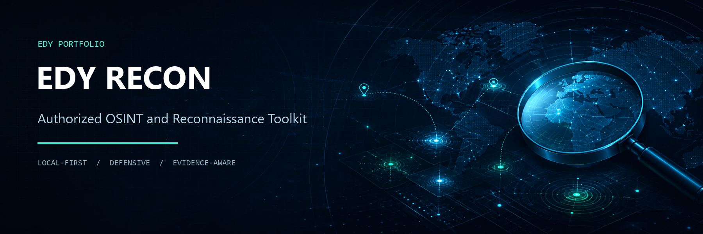
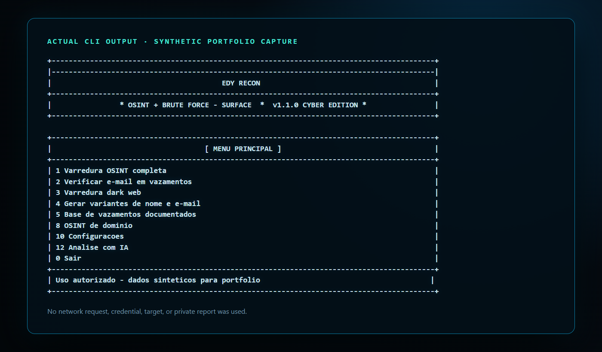

# EDY RECON 1.1.0

> OSINT, análise de superfície e testes controlados de credenciais para uso
> profissional autorizado.

    

Ferramenta de reconhecimento OSINT e teste de credenciais para profissionais de
segurança com **autorização formal**. Inclui base de vazamentos de dados
documentados (2007–hoje), verificação de e-mail/senha em fontes públicas,
varredura de dark web e brute force (SSH/FTP/HTTP-FORM).

> **Uso autorizado obrigatório:** execute somente em ativos próprios ou cobertos
> por autorização formal, com escopo, janela e limites definidos por escrito.
> Consulte [ACCEPTABLE_USE.md](ACCEPTABLE_USE.md) antes de operar módulos de rede.

## Demonstração



A captura acima foi produzida pela própria interface em modo ASCII e sem cor. Nenhuma rede, credencial, sessão, relatório privado ou alvo real foi usado.

## Status de validação

| Área | Estado |
|---|---|
| Windows e inicialização local | Validado |
| Suíte estritamente offline | **40/40 testes aprovados** |
| Menus e quatro temas | Validados com fixtures sintéticas |
| Relatórios TXT e HTML | Validados com sessão sintética |
| Kali Linux | Implementado; validação real pendente |
| APIs, IA e consultas externas | Implementadas; validação real pendente |
| SSH, FTP, HTTP e portas | Implementados; não executados na validação pública |

Nenhum resultado de integração real é alegado por esta versão. A suíte offline
bloqueia tentativas de rede e não utiliza alvos reais.

---

## 📂 Instalação e isolamento

| Ambiente | Pasta | Atalho |
|---|---|---|
| **Windows** | pasta escolhida pelo usuário | `EDYRECON.bat` ou atalho criado pelo instalador |
| **Kali Linux** | `/opt/EDYRECON` ou pasta do usuário | `EDYRECON.sh` ou atalho criado pelo pós-instalador |

Cada ambiente usa sua própria `.venv` e seu próprio `data/config.json`. O arquivo
de configuração, sessões e relatórios não devem ser copiados entre máquinas.

---

## 📦 Conteúdo do projeto

| Arquivo | Descrição |
|---|---|
| `edyrecon.py` | Programa principal (menu interativo) |
| `modules/` | Módulos: OSINT, dark web, vazamentos, brute force, senhas, relatórios |
| `data/breaches.json` | Catálogo local; não distribuído enquanto a proveniência estiver pendente |
| `data/passwords_base.lst` | Base local; não distribuída |
| `data/wordlists/` | Conteúdo baixado localmente; não distribuído pelo repositório |
| `data/config.example.json` | Exemplo público sem credenciais ou paths locais |
| `data/config.json` | Configuração privada gerada localmente; nunca publicar |
| `atualizar_wordlists.py` | Atualizador de wordlists (baixa o que falta e registra no config) |
| `verificar_wordlists.py` | Verificador: total de senhas, RAM usada, streaming por arquivo |
| `EDYRECON.bat` | Lançador do Windows (duplo clique) |
| `EDYRECON.sh` | Lançador do Kali (usado pelo atalho da Área de Trabalho) |
| `kali_pos_install.sh` | Pós-instalação no Kali (venv, permissões e atalho; cron opcional) |
| `kali_install.sh` | Instalador alternativo do Kali (outra pasta de destino) |
| `instalar_windows.bat` | Instalador/atualizador para **Windows** |
| `sync_to_kali.sh` | Sincroniza o projeto para o Kali via SSH |
| `kali_target.conf(.example)` | Configuração do Kali remoto (SSH) |
| `requirements.txt` | Dependências Python |
| `README.md` | Este guia |
| `modules/ai.py` | Integração de IA (Skynet Chat free + OpenAI-compatível) |
| `reports/` `sessions/` `logs/` | Diretórios locais privados; apenas `.gitkeep` é público |

---

## Wordlists locais e streaming

O ambiente local usado na validação continha 61 wordlists e uma base embutida,
totalizando 37.640.457 entradas. Esses arquivos **não fazem parte da distribuição
pública**. Os números abaixo descrevem apenas o ambiente local auditado:

| Métrica | Valor |
|---|---|
| Wordlists registradas | 61 |
| Total de senhas | **37.640.457** |
| Em RAM (base embutida + listas pequenas) | 227.986 senhas / **3,61 MB** |
| Em **streaming** (disco, não ocupa RAM) | 20 arquivos / 37.412.471 linhas |
| Espaço em disco | ~362 MB |

Listas acima de 512 KB são lidas em **STREAMING** (disco → linha a linha), então
**a memória RAM não cresce** mesmo com dezenas de milhões de senhas — ideal para
a VM do Kali com pouca RAM.

### Categorias das listas

| Categoria | Qtd. | Exemplos |
|---|---|---|
| 1) Clássicas | 3 | RockYou (14,3M), XatoNet 5.1M, XatoNet top-1M |
| 2) Comuns atuais | 12 | NCSC top-100k, Pwdb top-100k, probable-v2, darkweb2017, 2025-most-used... |
| 3) Por país/idioma | 20 | pt-BR (passphrases 2,4M, BRDumps, wordlist-br...), ES, FR, DE, CN, AR, IT, RU, TR, PL, NL, UA |
| 4) Vazamentos públicos | 12 | phpBB, MySpace, 000webhost, alleged-Gmail, md5decryptor-UK, Ashley-Madison (somente senhas, sem PII) |
| 5) Credenciais padrão | 14 | default-passwords, CIRT, betterdefaultpasslist (SSH/MySQL/Postgres/FTP/Windows/Tomcat/MSSQL/VNC/Oracle/DB2) |

> Disponibilidade pública não equivale a permissão de redistribuição. Origem,
> versão, hash e situação local estão registrados em
> [WORDLISTS_MANIFEST.csv](WORDLISTS_MANIFEST.csv). Entradas sem licença
> comprovada permanecem marcadas como “não distribuível / uso local”.

### Ver os números em qualquer ambiente

```bash
# Windows:                                      # Kali:
.venv\Scripts\python verificar_wordlists.py     ./.venv/bin/python verificar_wordlists.py
```

### Atualizar wordlists localmente

```bash
# Windows:                                      # Kali:
.venv\Scripts\python atualizar_wordlists.py     ./.venv/bin/python atualizar_wordlists.py
```

Opções do atualizador:
- `--force` — baixa **todas** as listas de novo (atualização completa);
- `--check` — só verifica e registra o que já existe no `config.json`.

Use apenas fontes compatíveis com sua autorização e política interna. O
atualizador **registra automaticamente os caminhos absolutos** no
`data/config.json` do sistema onde rodou — por isso ele deve ser executado
**uma vez em cada sistema** (Windows e Kali) depois de copiar a pasta.

Consulte [DATA_SOURCES.md](DATA_SOURCES.md) antes de obter ou distribuir dados.

---

## 🪟 Windows

Na pasta do projeto, execute `instalar_windows.bat`. O instalador exige um Python
3 já confiável, cria `.venv`, instala apenas `requirements.txt` dentro dela e
cria o atalho. Ele não instala pacotes no Python global.

### Reinstalar dependências / atalho

```bat
instalar_windows.bat
```

### Console simples e acessível

Os quatro temas continuam disponíveis. Para terminais sem suporte a cores ou
Unicode, inicie o launcher no mesmo `cmd.exe` após definir uma ou ambas as
variáveis abaixo:

```bat
set NO_COLOR=1
set EDYRECON_ASCII=1
EDYRECON.bat
```

`NO_COLOR` remove sequências ANSI; `EDYRECON_ASCII` troca bordas, ícones e
acentos por equivalentes ASCII. A interface também reduz e trunca rótulos para
acompanhar consoles estreitos sem quebrar a navegação.

## Execução e testes offline

A verificação pública não executa APIs, IA, OSINT real, brute force, SSH, FTP,
HTTP ou sondagem de portas. Com a `.venv` criada:

```bat
set PYTHONDONTWRITEBYTECODE=1
.venv\Scripts\python -B -m unittest discover -s tests -p "test_*.py" -v
.venv\Scripts\python -B tests\verify_public_release.py --local-with-private
```

O segundo comando audita somente a allowlist pública. Ele classifica paths
privados por nome e metadados, sem ler ou imprimir seus conteúdos.

---

## 🐉 Kali Linux

> **Estado:** fluxo implementado, mas a execução real no Kali não foi validada
> nesta preparação pública. Revise os scripts e use laboratório isolado.

Dentro da pasta do projeto, crie o ambiente isolado e o atalho com:

```bash
./kali_pos_install.sh
./EDYRECON.sh
```

O script cria `.venv`, instala somente as dependências declaradas, aplica
permissões privadas a configurações/saídas e usa o launcher portátil versionado.

### Atualização automática opcional

Nenhum cron é instalado por padrão. Para habilitar conscientemente uma execução
semanal, use `./kali_pos_install.sh --enable-weekly-update` e revise depois com
`crontab -l`.

### Sincronização segura para o Kali

Primeiro instale a cópia no Kali com `kali_install.sh`; isso cria o marker
`.edyrecon-managed`. Configure `kali_target.conf` localmente sem senhas e revise
o dry-run padrão:

```bash
bash sync_to_kali.sh
```

Depois de revisar todos os caminhos e mudanças exibidos, aplique explicitamente:

```bash
bash sync_to_kali.sh --apply
```

O sync valida host, porta, usuário, destino e marker. `data/config.json`,
`.venv`, sessões, relatórios e logs são sempre preservados e não são enviados.
No modo `--apply`, qualquer arquivo de código substituído ou retirado do espelho
é movido primeiro para `archive/sync-<timestamp>` no destino.

---

## 🧭 MENU PRINCIPAL

| Opção | Função |
|---|---|
| 1 | Varredura OSINT completa (e-mail + vazamentos + dark web + relatório) |
| 2 | Verificar e-mail em vazamentos |
| 3 | Varredura dark web |
| 4 | Gerar variantes de nome/e-mail |
| 5 | Base de vazamentos 2007–hoje (ver/exportar TXT/HTML) |
| 6 | Verificar senha vazada (HIBP) |
| 7 | Brute force (SSH/FTP/HTTP-FORM) |
| 8 | OSINT de domínio (crt.sh/RDAP/DNS/VT/ipinfo/Shodan/urlscan/OTX/Wayback/HackerTarget) |
| 9 | Relatórios salvos |
| 10 | Configurações (APIs/tema/wordlists/IA) |
| 11 | Sobre/ajuda |
| 12 | Análise com IA (relatório, domínio ou chat livre) |
| T | Trocar tema |

No brute force (opção 7 → fonte de senhas), a opção **"4 — Tudo"** percorre a
base embutida, variantes e wordlists configuradas, respeitando o limite seguro
`max_passwords`. Listas grandes continuam sendo lidas em streaming.

## 🧠 ANÁLISE COM IA (menu 12)

O EDY RECON ganhou integração de IA (mesma ideia do HackerAI/Skynet) para
**analisar relatórios de varredura, domínios e chat livre** — respostas em pt-BR:

| Opção | Função |
|---|---|
| 1 | Analisar o **último relatório/sessão salvo** com a IA |
| 2 | Análise rápida de domínio (DNS + crt.sh + Wayback + HackerTarget) → IA |
| 3 | Chat livre com a IA |
| 4 | Configuração (provider, credenciais, status) |

Providers implementados (`menu 10 → 6` ou `menu 12 → 4`):

| Provider | Custo | Como ativar |
|---|---|---|
| **Skynet Chat** (padrão) | Serviço externo | Configure sua própria conta no menu de IA |
| **Hack Club AI** | Serviço externo | Chave em https://ai.hackclub.com |
| **OpenRouter** | Serviço externo | Chave em https://openrouter.ai/keys |
| **OpenAI/Groq/Together** | Serviço externo | API compatível com `chat/completions` |
| **Ollama local** | Execução local | `ollama serve` + modelo local |
| **Custom** | — | URL OpenAI-compatível qualquer |

> A IA é opcional e não foi validada contra provedores reais nesta rodada. Falhas
> externas não impedem o uso das funções locais que não dependem do provider.

---

## 🔑 APIs (menu 10 → 1)

Sem chave, a ferramenta usa fontes públicas **sem chave**: crt.sh, RDAP, DNS,
EmailRep, Wayback Machine (CDX) e HackerTarget. Com chaves, libera o restante.

| API | Credencial | Onde obter |
|---|---|---|
| Hunter.io | opcional, conforme plano do provedor | https://hunter.io |
| VirusTotal | opcional, conforme plano do provedor | https://www.virustotal.com/gui/join-us |
| IntelligenceX | opcional, conforme plano do provedor | https://intelx.io/account |
| DeHashed | e-mail e chave, serviço do provedor | https://www.dehashed.com/ |
| HIBP | chave exigida para endpoints autenticados | https://haveibeenpwned.com/API/Key |
| EmailRep | opcional | https://emailrep.io |
| ipinfo | token opcional | https://ipinfo.io/signup |
| Shodan | opcional, conforme plano do provedor | https://account.shodan.io/register |
| urlscan | opcional, conforme plano do provedor | https://urlscan.io/user/signup |
| AlienVault OTX | opcional, conforme plano do provedor | https://otx.alienvault.com/api |

Cada chave entra no `menu 10 → 1 → número da API`. A interface usa entrada
oculta e exibição mascarada. Proteja `data/config.json`; ele nunca deve ser
publicado, sincronizado ou incluído em checkpoints.

---

## ⚙️ INSTALAÇÃO NO KALI (passo a passo)

Opção 1 — **instalação fácil** (pasta atual → `/opt/EDYRECON` + comando `edyrecon`):

```bash
cd /caminho/para/EDYRECON
sudo bash kali_install.sh
edyrecon
```

Opção 2 — **sincronizar via SSH**, começando obrigatoriamente pelo dry-run:

```bash
bash sync_to_kali.sh
# após revisar a prévia:
bash sync_to_kali.sh --apply
```

Opção 3 — **instalação limpa do zero** (sem a pasta):

```bash
sudo apt update && sudo apt install -y python3 python3-venv rsync
mkdir -p ~/Desktop/EDYRECON && cd ~/Desktop/EDYRECON
# copie a pasta do projeto (pendrive/scp) e rode:
sudo bash kali_install.sh
```

> No Kali, o symlink `edyrecon` aponta para o projeto. Para atualizar depois de
> uma nova sincronização, basta repetir a opção 1.

---

## 🔒 Nota sobre segredos

- O repositório e os pacotes de sincronização não devem conter chaves ou contas.
- Use somente credenciais próprias e confira custos/limites diretamente no provedor.
- Não copie `data/config.json`, sessões ou relatórios entre ambientes.
- Em suspeita de exposição, revogue a credencial no provedor e configure outra.

Copie [data/config.example.json](data/config.example.json) somente como
referência de estrutura. A aplicação cria e mantém a configuração privada local.

---

## 📁 Saídas geradas

- `reports/` — relatórios TXT/HTML e exportações da base de vazamentos
- `sessions/` — sessões de varredura (JSON)
- `logs/` — logs de atualizações executadas manualmente ou por cron explicitamente habilitado

Esses diretórios são privados e ignorados pelo controle de versão. Relatórios e
sessões podem conter e-mails, domínios, IPs e contexto de investigação mesmo
depois da remoção de campos conhecidos de senha ou token.

## Limites da distribuição pública

O repositório público contém código, testes, exemplos sintéticos e documentação.
Não contém:

- credenciais ou configurações locais;
- sessões, relatórios ou logs gerados;
- wordlists, bases de senha ou caches;
- `data/breaches.json`, até que proveniência e redistribuição sejam comprovadas;
- ambiente virtual ou artefatos da máquina do mantenedor.

## Documentação

- [Política de segurança](SECURITY.md)
- [Privacidade](PRIVACY.md)
- [Uso aceitável](ACCEPTABLE_USE.md)
- [Fontes e proveniência](DATA_SOURCES.md)
- [Avisos de terceiros](THIRD_PARTY_NOTICES.md)
- [Histórico de mudanças](CHANGELOG.md)
- [Licença MIT](LICENSE)

## Licença

O código e a documentação próprios do EDY RECON são disponibilizados sob a
[Licença MIT](LICENSE). Essa licença não cobre nem relicencia datasets,
wordlists, serviços externos ou dependências de terceiros.
